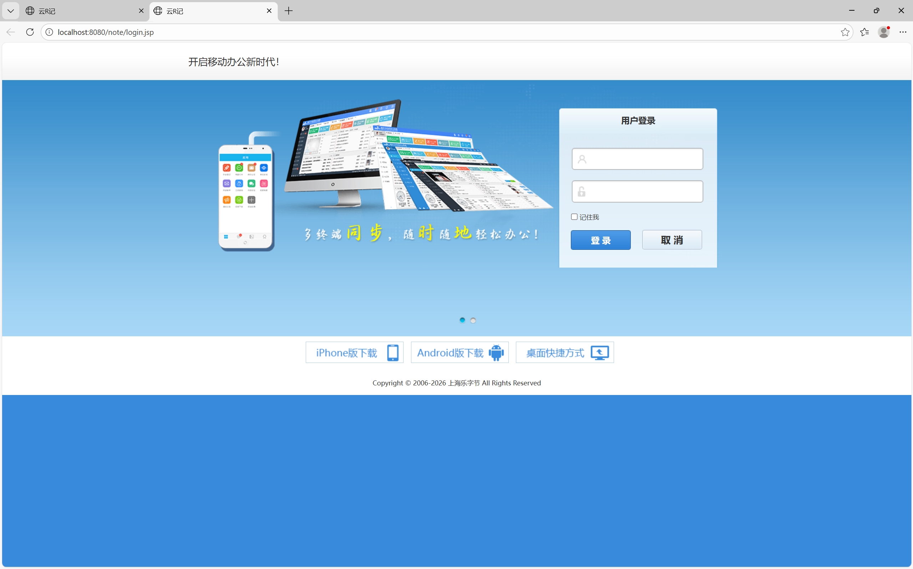
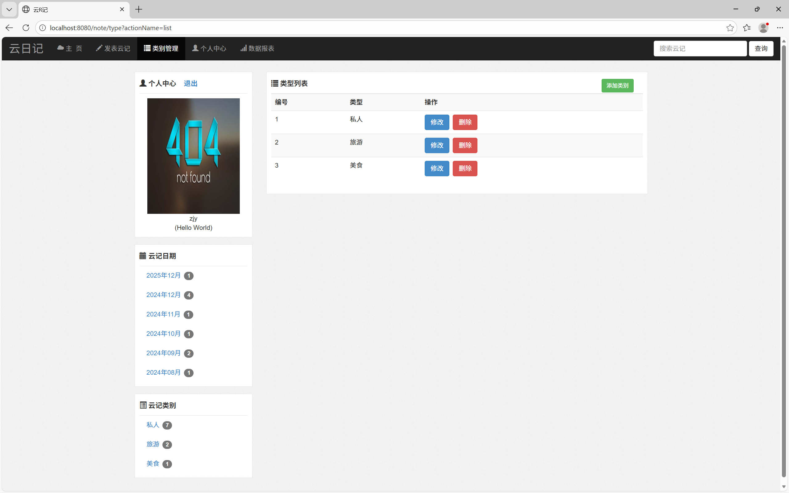
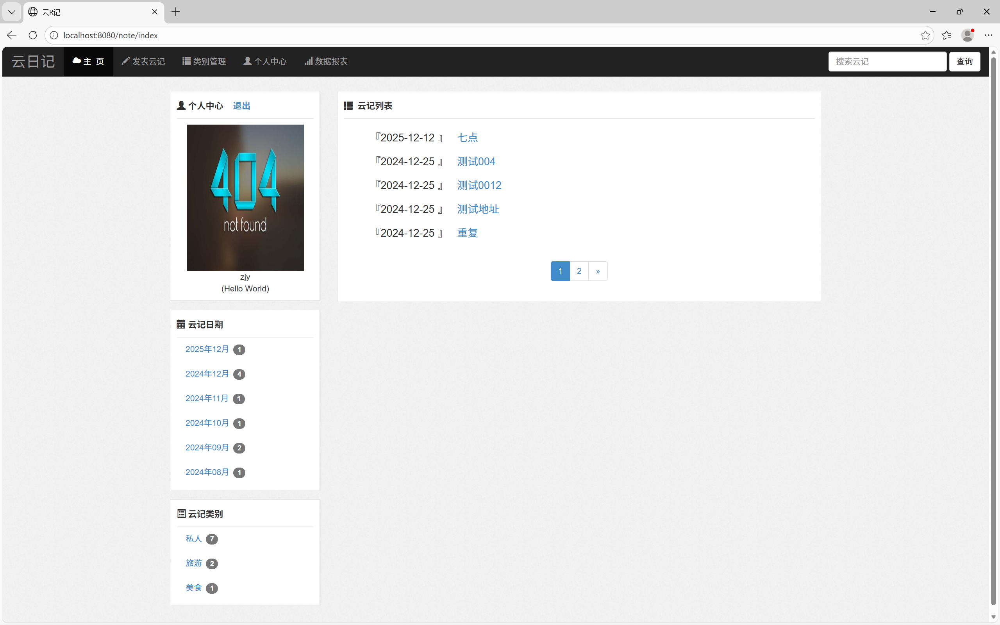

# YunDay - 云笔记管理系统（Java Web 版）

> 一个基于 Java EE 的轻量级笔记应用，支持分类管理、地理坐标记录与数据统计。



*图：登录页面*

---

## 项目简介

YunDay 是一个个人笔记管理 Web 系统，具备以下核心功能：

- 🔐 用户登录（默认账号：`meng` / 密码：`1597`）
- 📝 笔记增删改查，支持富文本内容
- 🗂 分类管理，支持自定义笔记类型
- 🌍 地理位置标记（经纬度字段 `lon`, `lat`）
- 📊 数据报表查看（笔记数量统计）
- 📎 文件上传（图片等资源）
- 💾 使用 MyBatis 操作 MySQL 数据库

> ⚠️ 当前版本不支持用户注册，需手动初始化用户表。

---

## 项目结构

YunDay/
├── src/main/java/com.yjx.note/
│   ├── dao/                 # 数据访问层
│   │   ├── NoteDao.java
│   │   ├── NoteTypeDao.java
│   │   └── UserDao.java
│   │
│   ├── filter/              # 过滤器
│   │   ├── EncodingFilter.java
│   │   └── LoginAccessFilter.java
│   │
│   ├── po/                  # 实体类（POJO）
│   │   ├── Note.java
│   │   ├── NoteType.java
│   │   └── User.java
│   │
│   ├── service/             # 业务逻辑层
│   │   ├── NoteService.java
│   │   ├── NoteTypeService.java
│   │   └── UserService.java
│   │
│   ├── util/                # 工具类
│   │   ├── JsonUtil.java
│   │   ├── MybatisUtils.java
│   │   └── Page.java
│   │
│   ├── vo/                  # 视图对象
│   │   ├── NoteVo.java
│   │   └── ResultInfo.java
│   │
│   └── web/                 # Servlet 控制层
│       ├── IndexServlet.java
│       ├── NoteServlet.java
│       ├── NoteTypeServlet.java
│       ├── ReportServlet.java
│       └── UserServlet.java
│
├── src/main/resources/
│   ├── com.yjx.note.dao/
│   │   ├── NoteDao.xml
│   │   ├── NoteTypeDao.xml
│   │   └── UserDao.xml
│   ├── db.properties         # 数据库配置
│   ├── log4j.properties      # 日志配置
│   └── mybatis-config.xml
│
├── src/main/webapp/
│   ├── note/                 # 笔记相关页面
│   ├── report/               # 报表页面
│   ├── statics/              # 静态资源（CSS, JS, 图片）
│   ├── type/                 # 分类管理页面
│   ├── user/                 # 用户相关页面
│   ├── WEB-INF/
│   │   ├── lib/              # 第三方 jar 包
│   │   ├── upload/           # 上传文件存储目录
│   │   └── web.xml
│   ├── index.jsp             # 首页
│   └── login.jsp             # 登录页
│
├── .mvn/
├── .idea/
├── target/                   # 编译输出目录
├── pom.xml                   # Maven 配置文件
└── web.xml                   # Web 应用部署描述符

---

## 快速启动

### 1. 环境准备

确保已安装：
- JDK 8+
- MySQL 5.7+
- Apache Tomcat 8+
- Maven 3+

### 2. 创建数据库

```sql
CREATE DATABASE IF NOT EXISTS cloud_diary DEFAULT CHARACTER SET utf8mb4;
USE cloud_diary;
```

### 3. 初始化用户表

```
-- 用户表
CREATE TABLE user (
    userId INT PRIMARY KEY AUTO_INCREMENT,
    uname VARCHAR(50) UNIQUE NOT NULL,
    upwd VARCHAR(100) NOT NULL,
    nick VARCHAR(50),
    head VARCHAR(255),
    mood TEXT
);

-- 分类表
CREATE TABLE note_type (
    typeId INT PRIMARY KEY AUTO_INCREMENT,
    typeName VARCHAR(50) NOT NULL,
    userId INT,
    FOREIGN KEY (userId) REFERENCES user(userId)
);

-- 笔记表
CREATE TABLE note (
    noteId INT PRIMARY KEY AUTO_INCREMENT,
    title VARCHAR(100) NOT NULL,
    content TEXT,
    typeId INT,
    pubTime DATETIME DEFAULT CURRENT_TIMESTAMP,
    lon FLOAT,
    lat FLOAT,
    FOREIGN KEY (typeId) REFERENCES note_type(typeId)
);
```

### 4.插入默认用户

```
INSERT INTO user (uname, upwd, nick, mood) 
VALUES ('meng', '1597', '管理员', '欢迎使用云笔记！');
```

### 5. 修改数据库配置

```
driver=com.mysql.cj.jdbc.Driver
url=jdbc:mysql://localhost:3306/cloud_diary?useUnicode=true&characterEncoding=utf8&serverTimezone=GMT%2B8&useSSL=false
username=root
password=1597
```

### 6. 构建与部属

```
mvn clean package
```

### 7. 访问

打开浏览器访问：http://localhost:8080/YunDay

- 账号：`meng`
- 密码：`1597`

-------

## 技术栈

| 层级     | 技术                    |
| -------- | ----------------------- |
| 后端语言 | Java 8                  |
| Web 框架 | Servlet + JSP           |
| ORM 框架 | MyBatis                 |
| 数据库   | MySQL                   |
| 构建工具 | Maven                   |
| 服务器   | Tomcat                  |
| 工具类   | Lombok, JSONUtil, Log4j |

-------

## 注意事项

- 请确保 `WEB-INF/lib` 中包含所需依赖（如 `mysql-connector-java`、`mybatis`、`servlet-api` 等）
- 上传文件保存在 `WEB-INF/upload` 目录，注意权限设置
- 若出现乱码，请检查编码过滤器是否生效
- 建议使用 UTF-8 编码保存所有文件

--------

## 运行截图







